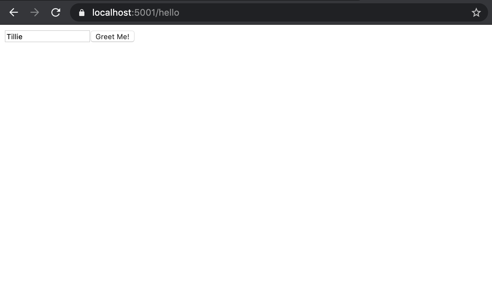
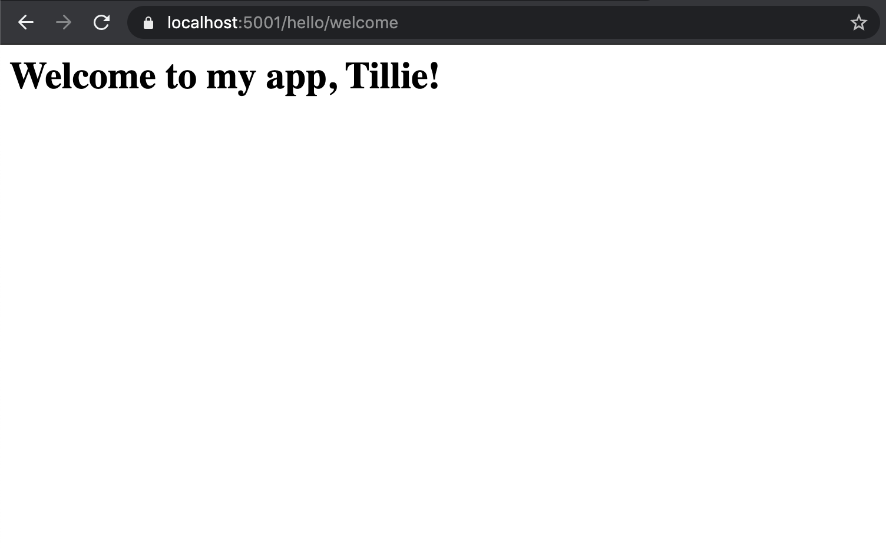

## Sending Form Data

What if we want to send over some form data?
To send data via a simple form in ASP.NET, we'll set things up like this:

We have an action method that generates a form at index and responds to a `GET` request. 
We will modify the `Index()` method we have already written like so and comment out any attributes we have been using:

```csharp {linenos = table}
   public IActionResult Index()
   {
      string html = "<form method='post' action='/hello/welcome'>" +
         "<input type='text' name='name' />" +
         "<input type='submit' value='Greet Me!' />" +
         "</form>";

      return Content(html, "text/html");
   }
```

With conventional routing, we know that the `Index()` method currently responds to `localhost:5001/hello`.
On form submission, we want to send the data down another path, `/hello/welcome`, which we specified in the `action` attribute in the `form` tag.
This is the path to our `Welcome()` method.
On line 4 above, we have given the text input the same name as the argument of the `Welcome()` method, which happens to be `name`.
By giving the route to the `Welcome()` method in `action`, specifying `POST` as the `method` attribute, and matching the argument to the input, we have set up the `Welcome()` method to handle the form submission.

With the `Index()` method rewritten and our `Welcome()` method handling form submission, we can run our app and see what happens!



Once we hit *Greet Me*, the value of `name`, `"Tillie"`, is submitted to the `Welcome()` method.



With our form working, we can add some attribute routing to streamline our code and specify routes and request types.
For the `Index()` method, we want the method to respond to a `GET` request at `localhost:5001/helloworld`.

```csharp {linenos=table}
   [HttpGet]
   [Route("/helloworld")]
   public IActionResult Index()
   {
      string html = "<form method='post' action='/hello/welcome'>" +
         "<input type='text' name='name' />" +
         "<input type='submit' value='Greet Me!' />" +
         "</form>";

      return Content(html, "text/html");
   }
```

Now we also want to add attributes to the `Welcome()` method.
`Welcome()` should respond to a `POST` request so we will add an `[HttpPost]` attribute.
We also want to use a `[Route("path")]` attribute to specify the route to be `localhost:5001/helloworld/welcome`.

```csharp {linenos = table}
   [HttpPost]
   [Route("/helloworld/welcome")]
   public IActionResult Welcome(string name = "World")
   {
      return Content("<h1>Welcome to my app, " + name + "!</h1>", "text/html");
   }
```

Now when we run our app, we can navigate to `localhost:5001/helloworld` and see our form.
Once we fill out the form and hit *Greet Me!*, the app redirects to `localhost:5001/hello/welcome` and breaks.
We didn't update `action` in our `<form>` tag in the `Index()` method.
Once we change the value of `action` to `/helloworld/welcome`, we can re-run our app and see it fully functioning.

{}

   The `Welcome()` method can respond to a `POST` request and the `Index()` method can respond to a `GET` request at the same URL.
   To make this happen, we change the route in the `action` attribute in the `<form>` tag and change the route in the `[Route("path")]` attribute above the `Welcome()` method to `/helloworld`.
   Re-running the app, we can submit the form and the page reloads to display our welcome message.

{}

## Check Your Understanding

{}

   Which type of request should the `Index()` method respond to?
 
   1. `GET` request
   1. `POST` request
   1. `PUT` request
   1. `DELETE` request

{}

<!-- a -->

{}

   Which type of request should the `Welcome()` method respond to?
 
   1. `GET` request
   1. `POST` request
   1. `PUT` request
   1. `DELETE` request

{}

<!-- b -->

{}

   True/False: two different action methods cannot respond to different request types at the same URL.

{}

<!-- False, they can! -->